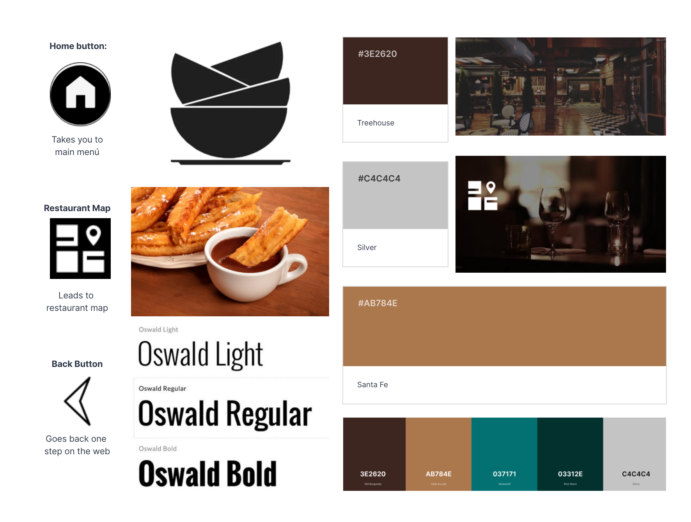

# DIU - Practica 3, entregables

## Moodboard (diseño visual + logotipo)   

## Landing Page

## Mockup: LAYOUT HI-FI

## Documentación: Publicación del Case Study

Para realizar el Layout HIFI hemos importado el proyecto de la práctica anterior desde Figma, y esto nos ha facilitado mucho a la hora de hacer esta parte.
Por lo demás, nos hemos repartido bastante equitativamente el trabajo y, aunque nos faltaba un poco de comprensión sobre lo que había que hacer, al final supimos sacarlo tranquilamente
 
