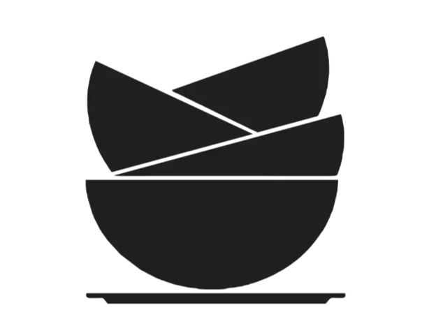
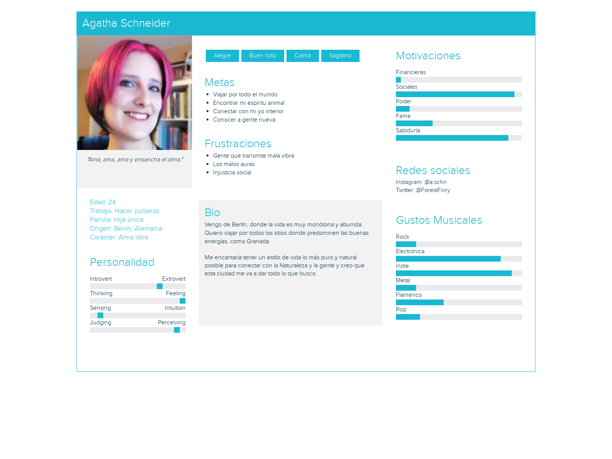
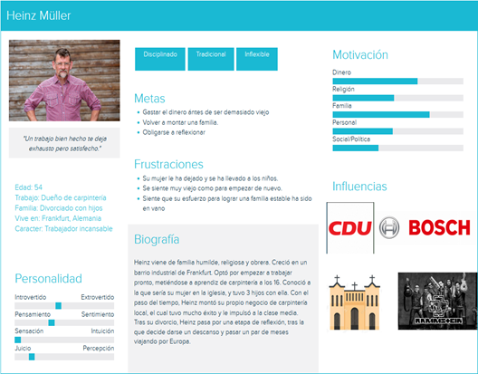
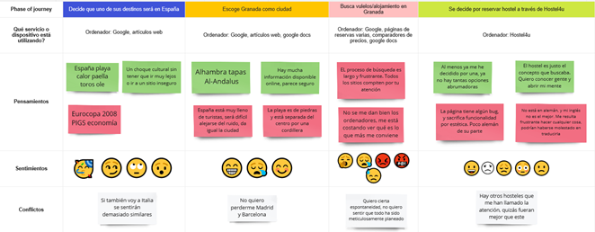

# DIU22
Prácticas Diseño Interfaces de Usuario 2021-22 (Tema: Hostels) 

Grupo: DIU3.6.  Curso: 2021/22 
Updated: 19/05/2022

Proyecto: 
>>> Restaurant 4U

Descripción: 

>>> Nos vamos a encargar de hacer el restaurante enlazado al hostel "Hostel4U"

Logotipo: 
>>> 
>>> 
Miembros
 * :bust_in_silhouette:   Javier Florido Cartolano     :octocat:     
 * :bust_in_silhouette:   Alejandro Pérez Argüello     :octocat:
 * :bust_in_silhouette:   Yelyzaveta Skochko           :octocat:

----- 

# Proceso de Diseño 

## Paso 1. UX Desk Research & Analisis 

 1.a Competitive Analysis
-----

>>> Partiendo del concepto de que la principal diferencia entre un hotel y un hostel es que en los hoteles se reservan habitaciones y en los hosteles se reservan plazas, encontramos que los hosteles observados parecen orientados a diferentes tipos de clientes, moviéndose en el espectro entre hostel puro y hostal/hotel. Hostel 4U y TOC ofrecen reserva de habitaciones privadas, indicando que también se abren a un público más afluente/reservado como familias/parejas, mientras que El Granado ofrece sobres todo servicios de cama barata u oportunidad de conocer gente en el sentido más tradicional de la idea de hostal. Por tanto, quizás no se puedan sacar muchas conclusiones de comprarlos (al menos Granado con los otros dos) con un mismo criterio de valoración ya que no intentan ofrecerte exactamente lo mismo.
Hostel 4U y TOC apuestan por abrirse a un mercado más amplio sin especializarse, quizás con la intención de dedicarse respondiendo a la demanda más adelante, mientras que El Granado tiene claro que está destinado a un público joven, social e internacional . Aun así los precios del servicio más característico de un hostal (cama individual en una habitación con más gente) no varían mucho entre las cadenas, indicando que El Granado apuesta fuerte por su atmósfera como atractivo principal.
Finalmente, en cuanto a páginas web, las tres opciones están actualizadas a un estándar moderno, con interfaces vistosas e intuitivas, y links a redes sociales. 

 1.b Persona
-----

>>> Hemos seleccionado estas personas porque consideramos que podrían ser usuarios típicos, pero saliéndonos de lo básico y común

 1.c User Journey Map
----

>>> Comenta brevemente porqué has escogido estas dos experiencias de usuario (y si consideras que son habituales) (80-150 caracteres) 

 1.d Usability Review
----
>>>  Revisión de usabilidad: (toma los siguientes documentos de referncia y verifica puntos de verificación de  usabilidad
>>>> SE deben incluir claramente los siguientes elementos
>>> - [Enlace al documento:](https://github.com/Javidroid/DIU/blob/master/P1/Usability%20Review.xls)
>>> - Valoración final (numérica): 71 - Good
>>> - Comentario sobre la valoración:  Como resumen, podemos mencionar que tiene un uso aceptable. No es el mejor, ya que contiene fallos, pero es lo suficientemente bueno como para que gran parte de las personas puedan utilizarlo, con la salvedad de personas con muy poca o ninguna experiencia con la tecnología, que se encontrarán altamente perdidos y sin saber qué hacer. Tal vez se pueda también dar el caso de una persona con mediana experiencia que tenga que repetir el proceso un par de veces porque se equivoque, o que tarde un poco más tiempo de lo normal para adaptarse, pero para resolver este problema se requeriría una gran cantidad de esfuerzo de diseño que no merece la pena gastar. Volver a mencionar que se echa de menos información referente a puntos de interés cercanos al sitio, formas de llegar, rutas de transporte, etc.

## Paso 2. UX Design  

 2.a Feedback Capture Grid / EMpathy map / POV
----

>>> Comenta con un diagrama los aspectos más destacados a modo de conclusion de la práctica anterior,

 Interesante | Críticas     
| ------------- | -------
  Preguntas | Nuevas ideas
  
    
>>> ¿Que planteas como "propuesta de valor" para un nuevo diseño de aplicación para economia colaborativa ?
>>> Problema e hipótesis
>>>  Que planteas como "propuesta de valor" para un nuevo diseño de aplicación para economia colaborativa te
>>> (150-200 caracteres)

 2.b ScopeCanvas
----
>>> Propuesta de valor 

 2.b Tasks analysis 
-----

>>> Definir "User Map" y "Task Flow" ... 

 2.c IA: Sitemap + Labelling 
----

>>> Identificar términos para diálogo con usuario  

Término | Significado     
| ------------- | -------
  Login¿?  | acceder a plataforma

 2.d Wireframes
-----

>>> Plantear el  diseño del layout para Web/movil (organización y simulación ) 

## Paso 3. Mi UX-Case Study (diseño)

 3.a Moodboard
-----

>>> Plantear Diseño visual con una guía de estilos visual (moodboard) 
>>> Incluir Logotipo
>>> Si diseña un logotipo, explique la herramienta utilizada y la resolución empleada. ¿Puede usar esta imagen como cabecera de Twitter, por ejemplo, o necesita otra?

  3.b Landing Page
----

>>> Plantear Landing Page 

 3.c Guidelines
----

>>> Estudio de Guidelines y Patrones IU a usar 
>>> Tras documentarse, muestre las deciones tomadas sobre Patrones IU a usar para la fase siguiente de prototipado. 

  3.d Mockup
----

>>> Layout: Mockup / prototipo HTML  (que permita simular tareas con estilo de IU seleccionado)

 3.e ¿My UX-Case Study?
-----

>>> Publicar my Case Study en Github..
>>> Documente y resuma el diseño de su producto en forma de video de 90 segundos aprox

## Paso 4. Evaluación 

 4.a Caso asignado
----

>>> Breve descripción del caso asignado con enlace a  su repositorio Github

 4.b User Testing
----

>>> Seleccione 4 personas ficticias. Exprese las ideas de posibles situaciones conflictivas de esa persona en las propuestas evaluadas. Asigne dos a Caso A y 2 al caso B
 

| Usuarios | Sexo/Edad     | Ocupación   |  Exp.TIC    | Personalidad | Plataforma | TestA/B
| ------------- | -------- | ----------- | ----------- | -----------  | ---------- | ----
| User1's name  | H / 18   | Estudiante  | Media       | Introvertido | Web.       | A 
| User2's name  | H / 18   | Estudiante  | Media       | Timido       | Web        | A 
| User3's name  | M / 35   | Abogado     | Baja        | Emocional    | móvil      | B 
| User4's name  | H / 18   | Estudiante  | Media       | Racional     | Web        | B 

. 4.c Cuestionario SUS
----

>>> Usaremos el **Cuestionario SUS** para valorar la satisfacción de cada usuario con el diseño (A/B) realizado. Para ello usamos la [hoja de cálculo](https://github.com/mgea/DIU19/blob/master/Cuestionario%20SUS%20DIU.xlsx) para calcular resultados sigiendo las pautas para usar la escala SUS e interpretar los resultados
http://usabilitygeek.com/how-to-use-the-system-usability-scale-sus-to-evaluate-the-usability-of-your-website/)
Para más información, consultar aquí sobre la [metodología SUS](https://cui.unige.ch/isi/icle-wiki/_media/ipm:test-suschapt.pdf)

>>> Adjuntar captura de imagen con los resultados + Valoración personal 

 4.d Usability Report
----

>> Añadir report de usabilidad para práctica B (la de los compañeros)

>>> Valoración personal 

>>> ## Paso 5. Evaluación de Accesibilidad  (no necesaria)

>>>   5.a Accesibility evaluation Report 
>>>> ----

>>> Indica qué pretendes evaluar (de accesibilidad) sobre qué APP y qué resultados has obtenido 

>>> 5.a) Evaluación de la Accesibilidad (con simuladores o verificación de WACG) 
>>> 5.b) Uso de simuladores de accesibilidad 

>>> (uso de tabla de datos, indicar herramientas usadas) 

>>> 5.c Breve resumen del estudio de accesibilidad (de práctica 1) y puntos fuertes y de mejora de los criterios de accesibilidad de tu diseño propuesto en Práctica 4.

## Conclusión final / Valoración de las prácticas

>>> (90-150 palabras) Opinión del proceso de desarrollo de diseño siguiendo metodología UX y valoración (positiva /negativa) de los resultados obtenidos  

