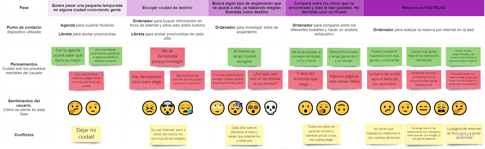
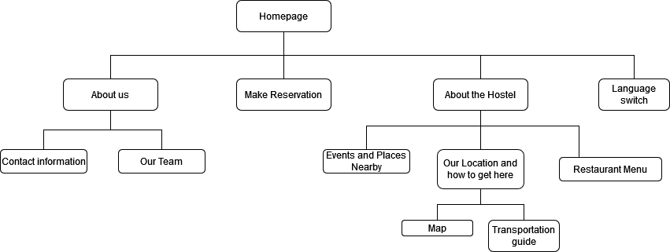
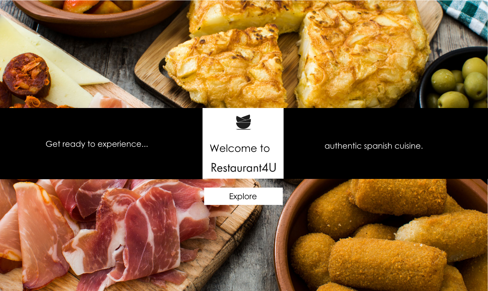
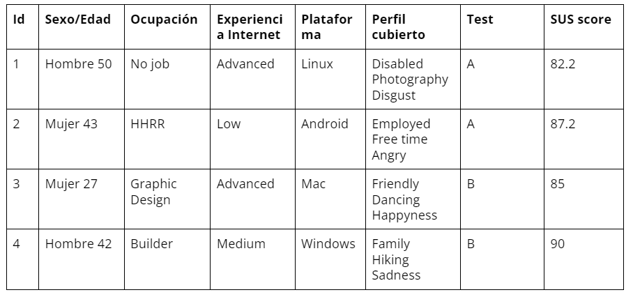

# DIU22
Prácticas Diseño Interfaces de Usuario 2021-22 (Tema: Hostels) 

Grupo: DIU3.6.  Curso: 2021/22 
Updated: 19/05/2022

Proyecto: 
>>> Restaurant 4U

Descripción: 

>>> Nos vamos a encargar de hacer el restaurante enlazado al hostel "Hostel4U"

Logotipo: 
>>> 
>>> 
Miembros
 * :bust_in_silhouette:   Javier Florido Cartolano     :octocat:     
 * :bust_in_silhouette:   Alejandro Pérez Argüello     :octocat:
 * :bust_in_silhouette:   Yelyzaveta Skochko           :octocat:

----- 

# Proceso de Diseño 

## Paso 1. UX Desk Research & Analisis 

 1.a Competitive Analysis
-----

>>> Partiendo del concepto de que la principal diferencia entre un hotel y un hostel es que en los hoteles se reservan habitaciones y en los hosteles se reservan plazas, encontramos que los hosteles observados parecen orientados a diferentes tipos de clientes, moviéndose en el espectro entre hostel puro y hostal/hotel. Hostel 4U y TOC ofrecen reserva de habitaciones privadas, indicando que también se abren a un público más afluente/reservado como familias/parejas, mientras que El Granado ofrece sobres todo servicios de cama barata u oportunidad de conocer gente en el sentido más tradicional de la idea de hostal. Por tanto, quizás no se puedan sacar muchas conclusiones de comprarlos (al menos Granado con los otros dos) con un mismo criterio de valoración ya que no intentan ofrecerte exactamente lo mismo.
Hostel 4U y TOC apuestan por abrirse a un mercado más amplio sin especializarse, quizás con la intención de dedicarse respondiendo a la demanda más adelante, mientras que El Granado tiene claro que está destinado a un público joven, social e internacional . Aun así los precios del servicio más característico de un hostal (cama individual en una habitación con más gente) no varían mucho entre las cadenas, indicando que El Granado apuesta fuerte por su atmósfera como atractivo principal.
Finalmente, en cuanto a páginas web, las tres opciones están actualizadas a un estándar moderno, con interfaces vistosas e intuitivas, y links a redes sociales. 

 1.b Persona
-----

>>> Hemos seleccionado estas personas porque consideramos que podrían ser usuarios típicos, pero saliéndonos de lo básico y común

 1.c User Journey Map
----

<<<

 1.d Usability Review
----
>>>  Revisión de usabilidad: (toma los siguientes documentos de referncia y verifica puntos de verificación de  usabilidad
>>>> SE deben incluir claramente los siguientes elementos
>>> - [Enlace al documento:](https://github.com/Javidroid/DIU/blob/master/P1/Usability%20Review.xls)
>>> - Valoración final (numérica): 71 - Good
>>> - Comentario sobre la valoración:  Como resumen, podemos mencionar que tiene un uso aceptable. No es el mejor, ya que contiene fallos, pero es lo suficientemente bueno como para que gran parte de las personas puedan utilizarlo, con la salvedad de personas con muy poca o ninguna experiencia con la tecnología, que se encontrarán altamente perdidos y sin saber qué hacer. Tal vez se pueda también dar el caso de una persona con mediana experiencia que tenga que repetir el proceso un par de veces porque se equivoque, o que tarde un poco más tiempo de lo normal para adaptarse, pero para resolver este problema se requeriría una gran cantidad de esfuerzo de diseño que no merece la pena gastar. Volver a mencionar que se echa de menos información referente a puntos de interés cercanos al sitio, formas de llegar, rutas de transporte, etc.

## Paso 2. UX Design  

 2.a Feedback Capture Grid / EMpathy map / POV
----

>>> Comenta con un diagrama los aspectos más destacados a modo de conclusion de la práctica anterior,

 Interesting  | Criticism | Questions | New ideas
 |-------|---------------|------------|------------
 |Illustrative, visual and elegand page | Upper bar hides some text | Where can I find info about interesting places nearby? | Fix the navigation bar|
 | Good pricing | Little info about the location and hotspots around it | | Add new languages|
 | Looks professional | Only English and Spanish as language options | | Improve navigation and design coherence|
 | | | | Make a page for the restaurant|
  
    
>>> ¿Que planteas como "propuesta de valor" para un nuevo diseño de aplicación para economia colaborativa ?
>>> Problema e hipótesis
>>>  Que planteas como "propuesta de valor" para un nuevo diseño de aplicación para economia colaborativa te
>>> (150-200 caracteres)

 2.b ScopeCanvas
----
>>> We want to improve some aspects of the page that can be polished. For example, the navigation bar that eclipses part of the text and keeps the user from reading it. 
We want to enhance the navigation so its easier to find the ways to reach the hostel. Also, add features including places of interest near the hostel, so we can upgrade the user experience.
Also, there’s a problem of the page’s indexation. So, when you are in one sub-page and you want to go to home page, it leads you to another version, maybe an older one.
But the improvement we are going to make is implementing the restaurant page because our clients want to taste typical Spanish food, and this will make better business.

 2.b Tasks analysis 
-----

User Groups |	Foreign users |	National Users |	Young users |	Old users|
------------|---------------|----------------|-------------|----------|
|Fix navigation bar|	High	|High	|High|	High|
|Add new languages|	High|	Low|	Low-Med|	Low|
|Add navigation coherence|	Med-High|	Med-High|	Med-High|	Medium|
|Add touristic info|	Med-High|	Med	|Med|	High|
|Ease arriving to hostel info|	Med-High|	Med	|Med	|High|
|Add restaurant page|	High|	High|	High-Med|	High|
 

 2.c IA: Sitemap + Labelling 
----

>>> Identificar términos para diálogo con usuario  
>>> 

Label|	Scope Note|
-----|-----------|
|Homepage|	The main hub from which to access all the resources|
|About Us|	Information about the hostel owners|
|Contact Information|	Social media, email, phone numbers to reach relevant contacts|
|Our Team|	Brief introduction of the owners and the staff|
|Make Reservation|	Make a personalized reservation online|
|Language switch	|Choose your language of preference|
|About the Hostel	|Information about the hostel itself and its surroundings|
|Events and Places Nearby|	A list of cultural sites such as restaurants, museums, concert venues etc… that may be interesting to the visitors|
|Our Location and how to get here|	Helpful information for customers to find their way to the hostel|
|Map	|Map of the entourage of the hostel|
|Transportation guide|	An article detailing how to reach the hostel from the most important airports/train and bus stations, including bus/metro lines.|
|Restaurant Menu	|An online menu for the hostel’s own restaurant|

 2.d Wireframes
-----

>>> [Plantear el  diseño del layout para Web/movil (organización y simulación ) ](https://github.com/Javidroid/DIU/blob/master/P2/DIU3.6_P2-Prototype.pdf)

## Paso 3. Mi UX-Case Study (diseño)

 3.a Moodboard
-----

>>> 
Our color palette is chosen that way because earthy tones inspire tranquility and relaxation, which are the feelings we want to transmit. Darker tones make it more elegant.
The icons are basic and as minimalistic as possible so it doesn’t interfere with the usability of the design
The font is simple, elegant and direct.

>>> Logotipo:

  3.b Landing Page
----

>>> 
>>> We opted for a very simplistic design, with an image of appetizing spanish dishes as a background. In the middle stripe we got the logo for brand recognition, a simple enticing slogan and a clear way to access the website.

 3.c Guidelines
----

>>> We are going to use Material Design as a Guideline because of its simplicity, the visual quality it produces.
Besides, it’s the Guideline that all Android users are used to.

  3.d Mockup
----

>>> Layout: Lo podemos encontrar en el siguiente enlace: https://cloud.protopie.io/p/779e42f389

 3.e ¿My UX-Case Study?
-----

Publicado en GitHub en estas mismas lineas que estás leyendo ;)

## Paso 4. Evaluación 

 4.a Caso asignado
----

>>> [Restaurante del Hostel4U](https://github.com/LegalyAlexander/DIU)

 4.b User Testing
----

>>> Seleccione 4 personas ficticias. Exprese las ideas de posibles situaciones conflictivas de esa persona en las propuestas evaluadas. Asigne dos a Caso A y 2 al caso B
 

| Usuarios | Sexo/Edad     | Ocupación   |  Exp.TIC    | Personalidad | Plataforma | TestA/B
| ------------- | -------- | ----------- | ----------- | -----------  | ---------- | ----
| Eustaquio     | H / 50   | Desempleado | Avanzada    | Amargo       | Linux      | A 
| Loli          | M / 43   | RRHH        | Baja        | Estresada    | Android    | A 
| Virginia      | M / 27   | Diseño Gráfico| Avanzada  | Alegre       | Mac        | B 
| Juan José     | H / 42   | Albañil     | Media       | Trabajador   | Windoes    | B 

. 4.c Cuestionario SUS
----

>>> Usaremos el **Cuestionario SUS** para valorar la satisfacción de cada usuario con el diseño (A/B) realizado. Para ello usamos la [hoja de cálculo](https://github.com/mgea/DIU19/blob/master/Cuestionario%20SUS%20DIU.xlsx) para calcular resultados sigiendo las pautas para usar la escala SUS e interpretar los resultados
http://usabilitygeek.com/how-to-use-the-system-usability-scale-sus-to-evaluate-the-usability-of-your-website/)
Para más información, consultar aquí sobre la [metodología SUS](https://cui.unige.ch/isi/icle-wiki/_media/ipm:test-suschapt.pdf)

>>> 
>>> By looking at the numbers we conclude that prototype B is slightly better than A. We can infer that maybe B has more info and interactive actions than A. This can be better or worse depending how you look at it. A is better for inexperienced users, as it's simpler, but B has more functionality. It is also clear that, graphically, B catches the eye more effectively than A, and has a more iconic graphic design, which gave it the edge in terms of user satisfaction.

 4.d Usability Report
----

>> Añadir report de usabilidad para práctica B (la de los compañeros)

>>> Valoración personal 

>>> ## Paso 5. Evaluación de Accesibilidad  (no necesaria)

>>>   5.a Accesibility evaluation Report 
>>>> ----

>>> Indica qué pretendes evaluar (de accesibilidad) sobre qué APP y qué resultados has obtenido 

>>> 5.a) Evaluación de la Accesibilidad (con simuladores o verificación de WACG) 
>>> 5.b) Uso de simuladores de accesibilidad 

>>> (uso de tabla de datos, indicar herramientas usadas) 

>>> 5.c Breve resumen del estudio de accesibilidad (de práctica 1) y puntos fuertes y de mejora de los criterios de accesibilidad de tu diseño propuesto en Práctica 4.

## Conclusión final / Valoración de las prácticas

>>> (90-150 palabras) Opinión del proceso de desarrollo de diseño siguiendo metodología UX y valoración (positiva /negativa) de los resultados obtenidos  

